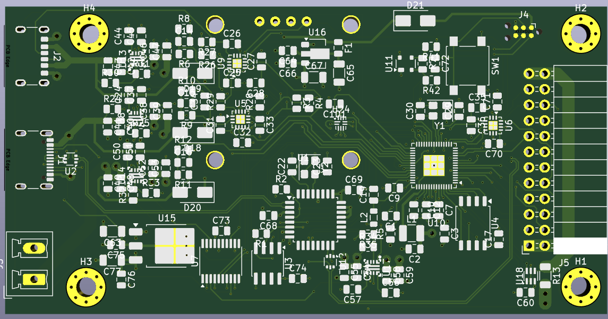
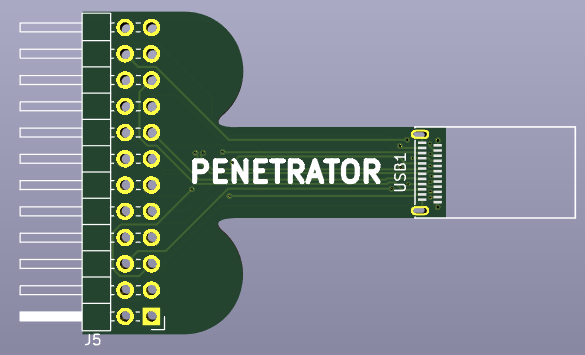
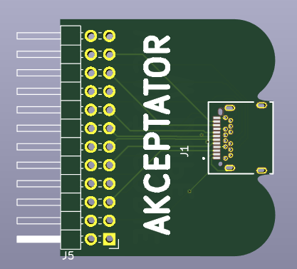
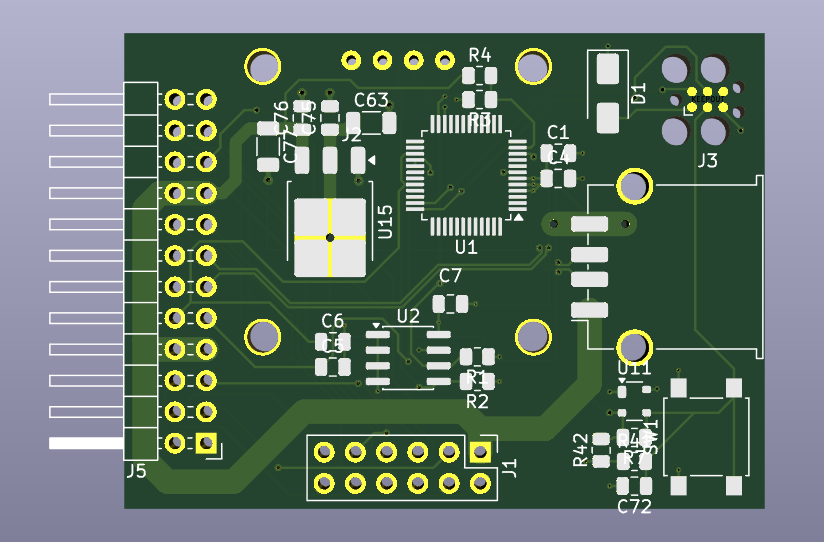

# USB RPi DAP probe

This board was created to utilize the USB debug accessory mode. In this mode, the unused USB 3 super speed lines aren't used for USB but can be repurposed for other interfaces such as UART, SWD, or JTAG. These other protocols will be handled by the RP2350's PIO module, which can be used to create an arbitrary bus. The project consists of the main board, featuring a USB hub and Raspberry Pi, along with several auxiliary boards designed to allow quick changes to the target connector. Options include a USB plug, a USB receptacle for connecting a cable, and a breakout board.

### Boards
#### Main board

#### Aux boards

